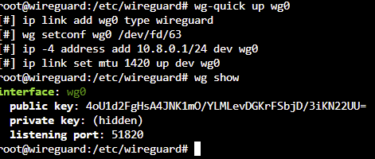
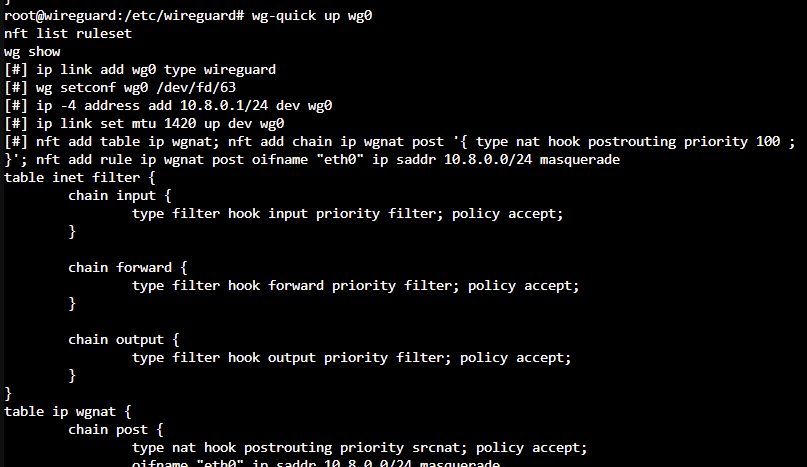
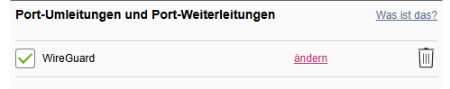
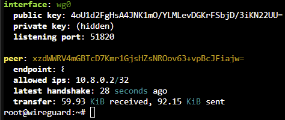
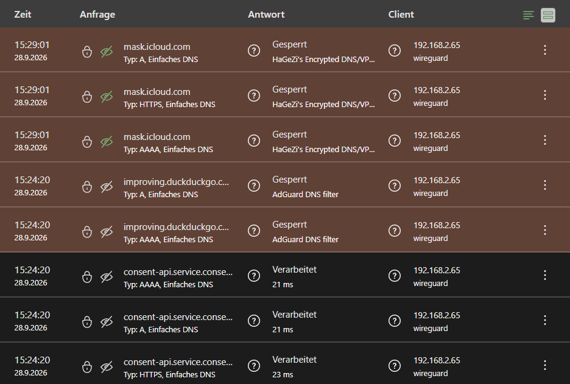
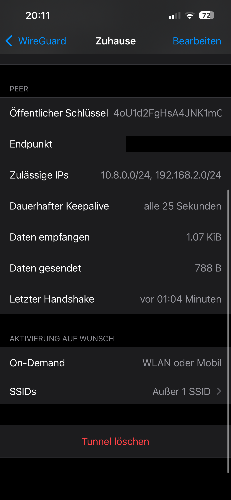
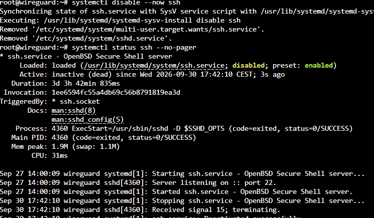
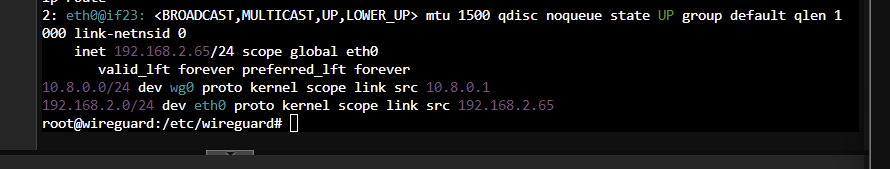
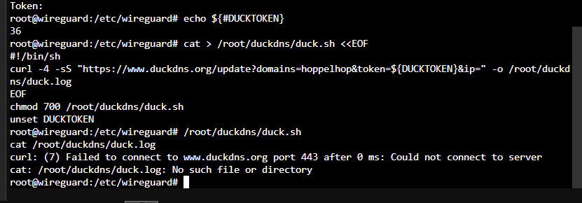
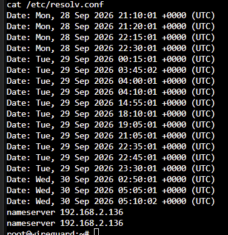

# wireguard_vpn
Proxmox,Debian,WireGuard

Sicherer Fernzugriff auf mein Homelab und netzwerkweite DNS-Filterung auch unterwegs – selbst gehostet auf meinem Proxmox-Server.

## Über das Projekt
WireGuard läuft als LXC-Container (Debian 13) auf meinem Proxmox-Server. Über einen Tunnel erreicht mein iPhone von unterwegs das Heimnetz und nutzt dabei weiterhin AdGuard als DNS-Filter. Offen ist am Router nur ein einziger UDP-Port – alle anderen Dienste bleiben von außen unerreichbar.

## Aufbau

```
iPhone (Mobilfunk / fremdes WLAN)
   │  verschlüsselter Tunnel, UDP 51820
   ▼
Internet → Router (Portfreigabe) → WireGuard-Container (192.168.2.65)
                                        │  NAT
                                        ▼
                     Heimnetz 192.168.2.0/24: AdGuard Home, Proxmox, Active Directory
```

- **Tunnelnetz:** 10.8.0.0/24 (Server 10.8.0.1, iPhone 10.8.0.2) – getrennt vom Heimnetz, damit jederzeit erkennbar ist, ob ein Paket aus dem Tunnel oder aus dem LAN kommt
- **Split-Tunnel:** Nur DNS-Anfragen und Zugriffe aufs Heimnetz laufen durch den Tunnel, normaler Internetverkehr geht direkt raus
- **On-Demand:** Tunnel startet automatisch im Mobilfunk und in fremden WLANs, im Heim-WLAN bleibt er aus

## Was ich gemacht habe

### Container und Netzwerk
- Unprivilegierter LXC-Container: Selbst bei einer Übernahme des Containers keine Root-Rechte auf dem Proxmox-Host – bei einem Dienst, der ins Internet zeigt, Pflicht
- Feste IP direkt in Proxmox statt per DHCP, damit der VPN-Zugang nicht davon abhängt, dass AdGuard Home läuft
- DNS mit Rückfallebene: AdGuard Home zuerst, Quad9 (9.9.9.9) als Fallback

### WireGuard-Server
- Schlüsselpaare mit `wg genkey` / `wg pubkey` erzeugt, Dateirechte auf `600` (nur root lesbar)
- IP-Forwarding aktiviert und NAT (Masquerading) per nftables über `PostUp`/`PostDown`, damit Geräte im Heimnetz auf Anfragen aus dem Tunnel antworten können
- Autostart über `systemctl enable wg-quick@wg0`

### Erreichbarkeit von außen
- Vorab geprüft, dass der Anschluss eine echte öffentliche IPv4 hat (kein CGNAT)
- DynDNS über DuckDNS: Ein Cron-Job meldet alle 5 Minuten die aktuelle IP, Fehler landen in einer Logdatei
- Portfreigabe am Router bewusst als letzter Schritt – erst als dahinter ein fertig konfigurierter Dienst lief

### Härtung
- SSH-Dienst **und** SSH-Socket deaktiviert (Verwaltung nur über die Proxmox-Konsole)
- Nicht benötigten Mailserver (Postfix) entfernt
- Automatische Sicherheitsupdates mit `unattended-upgrades`
- Wöchentliches Proxmox-Backup des Containers (letzte 3 bleiben erhalten)

## Troubleshooting-Beispiele

| Symptom | Ursache | Lösung |
|---|---|---|
| Container ohne IP, `eth0` im Status DOWN | IPv4 beim Anlegen auf „Static“ ohne Adresse – keine Konfiguration für `eth0` | In Proxmox auf DHCP bzw. feste IP umgestellt |
| `apt` und `curl`: „Network is unreachable“ | Keine Default-Route – IPv4-Gateway fehlte | Feste IP inkl. Gateway in Proxmox gesetzt |
| DuckDNS-Update scheitert nach 0 ms | AdGuard Home blockt duckdns.org (HaGeZi DynDNS-Blocklist) → Antwort `0.0.0.0` | Ausnahmeregel `@@\|\|duckdns.org^` |
| Fehler beim ersten Neustart des Tunnels | Neue `PostDown`-Regel wollte eine NAT-Tabelle löschen, die es noch nicht gab | Einmalig nur `wg-quick up`, danach sauber |
| SSH nach `systemctl disable` weiter erreichbar | Debian 13 startet SSH per Socket-Aktivierung neu | Zusätzlich `ssh.socket` deaktiviert, mit `ss -tlnp` geprüft |
| Sporadische Cron-Fehler „Could not resolve host“ | Nur ein DNS-Server; die Zeitstempel waren verstreut statt gebündelt → einzelne Timeouts, kein Ausfall | Quad9 als zweiter Resolver |
| On-Demand ignoriert das Heim-WLAN | Unsichtbares Leerzeichen am Ende des WLAN-Namens | Eintrag korrigiert |

## Designentscheidung: AdGuard statt iCloud Private Relay
Private Relay verschleiert die eigene IP, indem es Verbindungen über zwei Betreiber leitet. Dafür laufen DNS-Anfragen an der lokalen Filterung vorbei, und Werbe- und Tracking-Traffic geht wieder durch. Logs entstehen in beiden Fällen, nur verteilt. Für einen normalen Nutzer ist Tracking das reale Risiko, nicht der Provider. Deshalb hat die lokal kontrollierte Filterung Vorrang 

## Was ich gelernt habe
- Asymmetrische Schlüssel in der Praxis: Jede Seite behält ihren privaten Schlüssel und kennt nur den öffentlichen der Gegenseite
- Routing und NAT: Warum ein VPN-Server Pakete weiterleiten und als Absender auftreten muss
- Unterschied zwischen Erreichbarkeit (öffentliche IP, DynDNS, Portfreigabe) und Sicherheit (Schlüssel-Authentifizierung)
- Angriffsfläche minimieren: Was nicht läuft, kann nicht angegriffen werden
- Systematisches Troubleshooting: Fehlermeldung lesen → Hypothese → gezielt prüfen (`ip a`, `ip route`, `dig`, `ss`) → beheben → verifizieren
- Abhängigkeiten zwischen Diensten erkennen: Mein VPN darf nicht davon abhängen, dass mein DNS-Filter läuft

## Verwendete Technologien
- WireGuard (`wireguard-tools`, `wg-quick`)
- Proxmox VE (unprivilegierter LXC-Container, Debian 13)
- nftables (NAT)
- DuckDNS, cron
- AdGuard Home (DNS)
- WireGuard-App für iOS (On-Demand)
- Claude Sonnet/Opus

## Screenshots

**Tunnel gestartet – NAT-Regeln werden automatisch gesetzt:**


**NAT-Regel in nftables:**


**Einzige Portfreigabe am Router: WireGuard (UDP 51820):**


**Tunnel aktiv – Handshake aus dem Mobilfunk:**


**DNS-Anfragen des iPhones laufen durch den Tunnel:**


**On-Demand-Regeln in der iOS-App:**


**Härtung – SSH deaktiviert:**


**Troubleshooting – fehlende Default-Route:**


**Troubleshooting – DuckDNS von AdGuard geblockt:**


**Troubleshooting – verstreute DNS-Fehler, nur ein Resolver:**

